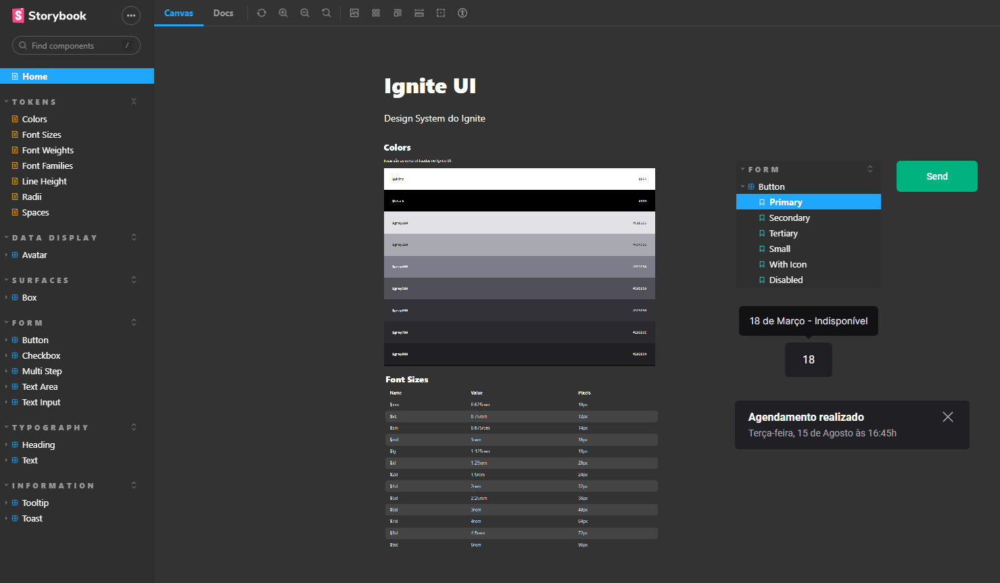

## 🎉 Let's go!

Para iniciar o projeto insira o comando <code>npm run dev</code>


## 💻 Projeto

O projeto desenvolvido documenta diversos componentes no <strong>Storybokk</strong> e disponibiliza esses componentes em uma biblioteca <strong>NPM</strong> para instalação


#### Link do projeto no Github Pages: 
🔗: https://anna-luiza-gusmao.github.io/design-system-storybook/?path=/story/home--page


#### Comandos para instalação dos pacotes:
```
npm i @anna-ignite-ui-dev/tokens
```
```
npm i @anna-ignite-ui-dev/react
```


## 🚀 Tecnologias

Esse projeto foi desenvolvido com as seguintes tecnologias:

- Typescript
- React
- Node e NPM
- Github Pages
- Turbo
- Monorepo
- Vite
- Storybook
- Changeset